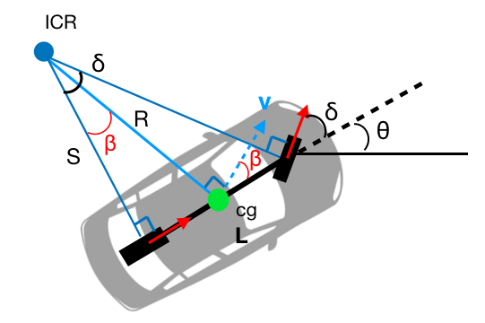
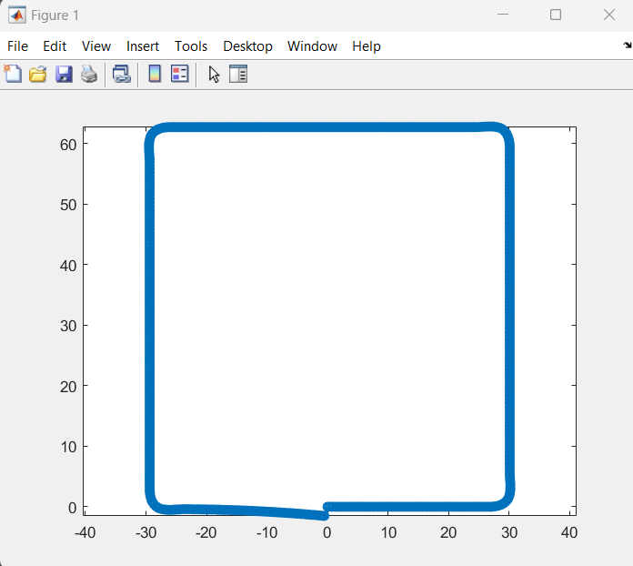

Kinematic Bicycle model implemented in MATLAB

Each of the files creates a differen't path for the bicycle model by either changing certain parts of the code, or key values. 

Here is the basic image of the model

By tuning certain parameters such as the velocity, theta, delta and adding custom logic.
Paths that the car can travel can be plotted.
Here is an exmaple of waht the square file would output

